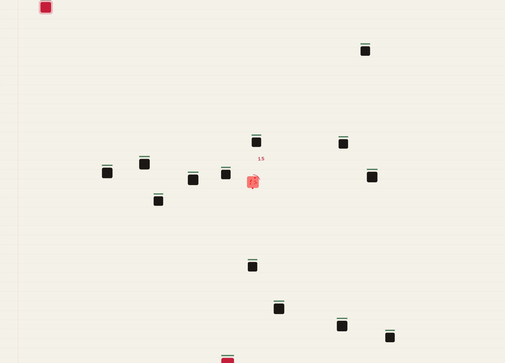

# Word Survivor

Type words. Kill enemies. Survive.

**[Play now at wordsurvivor.com](https://wordsurvivor.com)**

## Screenshot



## What is this?

Word Survivor is a typing survival game. Enemies swarm you, each carrying a word — type it to fire a projectile and take them out. Chain words fast for combo damage, collect items with stacking synergies, level up between waves, and see how long you last.

The whole game is a single HTML file. No framework, no build step, no dependencies. Just open `index.html` and play.

## How to play

- **Type** the word shown on an enemy to attack it
- **Move** with WASD or arrow keys — movement freezes time, but you can't type while moving
- **Collect items** dropped by enemies (every 3 kills) — items stack and synergize
- **Level up** by collecting XP gems to choose upgrades between waves
- **Survive** as long as you can against 16 enemy types and elite modifiers

## Run locally

```bash
git clone https://github.com/kylesnav/word-survivor.git
cd word-survivor
open index.html
```

For PWA/service worker features, serve it:

```bash
python3 -m http.server 8080
```

## Run tests

```bash
cd tests && npx playwright test
```

## Tech

Single-file vanilla JS game (~10k lines). Canvas 2D rendering, Web Audio API for procedural sound, CSS custom properties for theming, service worker for offline play. Zero external JS dependencies — just Google Fonts and Lucide Icons from CDN.

## License

MIT
